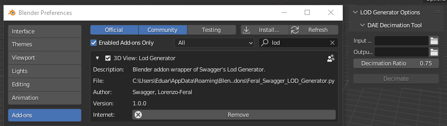

# LOD Generator

> It's recommended opening this readme.md file in a markdown editor/interface for proper displaying.


## Authors & Credits

- *Eduardo Carvalho*

- *Feral Interactive* - for their assistance in making the Blender Addon

  

ABOUT
---------------

> This Blender addon allows the automatic generation of LODs - Level of Detail meshes.
>
> > In [computer graphics](https://en.wikipedia.org/wiki/Computer_graphics), **level of detail** (**LOD**) refers to the complexity of a [3D model](https://en.wikipedia.org/wiki/3D_model) representation.[[1\]](https://en.wikipedia.org/wiki/Level_of_detail_(computer_graphics)#cite_note-1)[[2\]](https://en.wikipedia.org/wiki/Level_of_detail_(computer_graphics)#cite_note-2)[[3\]](https://en.wikipedia.org/wiki/Level_of_detail_(computer_graphics)#cite_note-3) LOD can be decreased as the model moves away from the viewer or  according to other metrics such as object importance, viewpoint-relative speed or position. LOD techniques increase the efficiency of [rendering](https://en.wikipedia.org/wiki/Rendering_(computer_graphics)) by decreasing the workload on [graphics pipeline](https://en.wikipedia.org/wiki/Graphics_pipeline) stages, usually [vertex transformations](https://en.wikipedia.org/wiki/Vertex_transformations). The reduced visual quality of the model is often unnoticed because of  the small effect on object appearance when distant or moving fast.

Installation
---------------

To install this addon, download the zip in **releases** and follow Blender's documentation on Addon Installation:

> https://docs.blender.org/manual/en/latest/editors/preferences/addons.html#installing-add-ons



## Usage Instructions

	0. Download attached .zip in Releases
	1. To use the addon, after enabling, a small panel called "Mod - Rome Remastered" will appear in the viewport sidebar.
	2. Choose an input & output folder
	3. Choose a decimation level
	4. Press **Generate Lods**
	5. The new LODs should have been created in the output folder

MANTAINERS
---------------

This program is maintained by:

```markdown
| Eduardo Carvalho | fc55881@alunos.fc.ul.pt | Master's in Informatics | FCUL |
```
